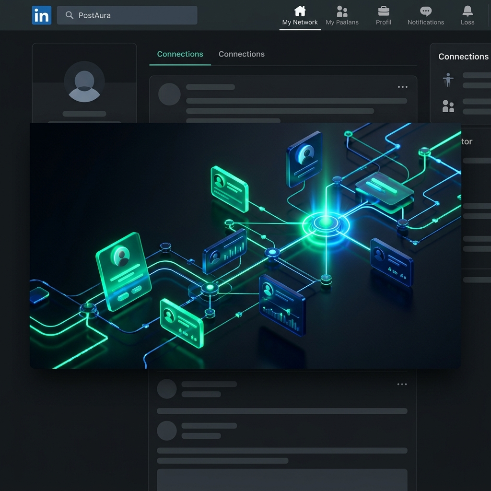
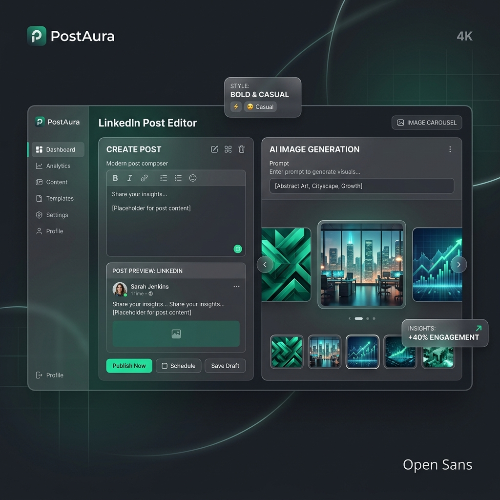

<p align="center">
  
</p>

<div align="center">
  <h1>🌀 PostAura: The Writer's Engine</h1>
  <p>🚀 <b>Consistent LinkedIn presence in 120 seconds. Built for Builders.</b></p>
  
  <p>
    <a href="https://github.com/Ashurai84/Post-Aura/stargazers"></a>
    <a href="https://github.com/Ashurai84/Post-Aura/network/members"></a>
    
  </p>
</div>

---

## ⚡ The Reality Check
College is fast. Building is faster. LinkedIn is a game of **Consistency**, but you have **Zero Time**. 
PostAura isn't just another ChatGPT wrapper. It's a **context-aware Writing DNA engine** that understands your stance before it types a single letter.

### **✨ Why 1,000+ Clicks?**
*Because we solve the "Blank Page" problem forever.*

- **🧠 Style DNA**: PostAura learns your sentence rhythm, emoji density, and storytelling "voice". 
- **🎨 Visual Engine**: Don't waste time on Canva. Get high-end, scroll-stopping AI art mapped to your post content instantly.
- **🛡️ Secure Command Center**: A standalone, high-performance Admin Dashboard to track every click, every generation, and every user.

---

## 🏗️ The Architecture
PostAura is built with a **Decoupled, Scalable Core** to ensure zero-latency generations.

<p align="center">
  
</p>

- **⚡ Core React 19 Frontend**: Ultra-minimalist dark mode designed for focus.
- **🛡️ Node.js API Gateway**: Secure, restricted, and high-performance.
- **📊 Isolated Admin Dashboard**: A separate project entity protected by a secret route and Firebase Auth.

---

## 🛠️ The Gear
| Layer | Stack |
| :--- | :--- |
| **Logic** | TypeScript (Strict), Zod, Express |
| **UI/UX** | React 19, Tailwind CSS v4, Framer Motion |
| **Storage** | Google Firebase (Auth & Firestore) |
| **Generative** | Google Gemini 2.5 Flash, Pollinations AI |

---

## 🚀 Ignition Sequence

```bash
# 1. Clone the Engine
git clone https://github.com/Ashurai84/Post-Aura.git

# 2. Install Dependencies
npm install
cd admin && npm install

# 3. Fire Up
npm run dev:backend   # API on Port 3000
npm run dev:frontend  # User App on Port 5173
npm run dev:admin     # Command Center on Port 5174
```

---

<p align="center">
  <b>PostAura is built for those who build in public. Stop scrolling, start leading.</b><br>
  <sub><i>Crafted with ❤️ for the next generation of SaaS creators.</i></sub>
</p>

<div align="center">
  
  
</div>
